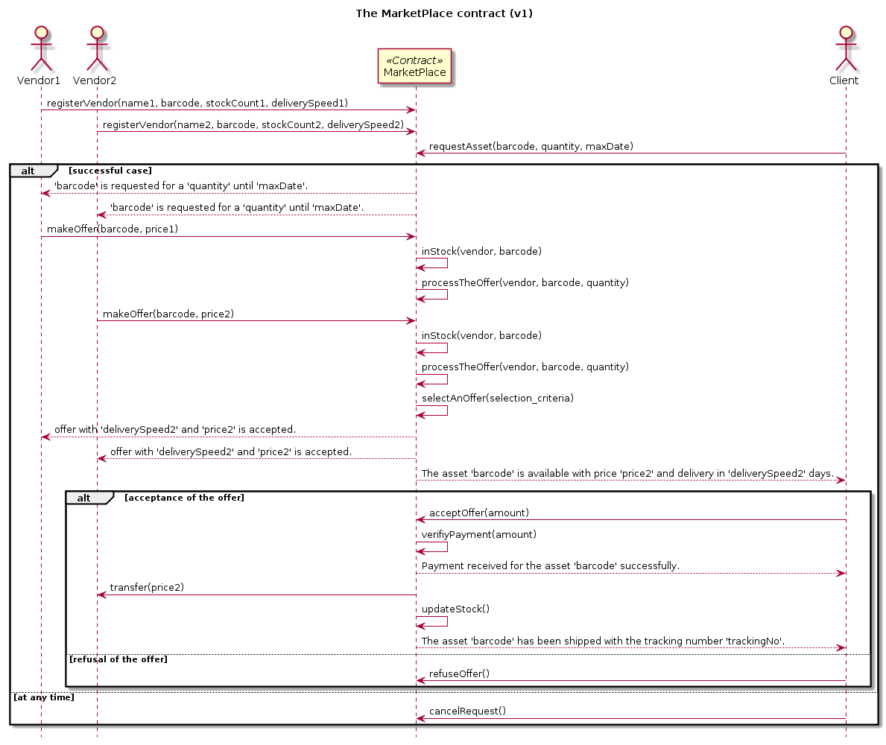

# MarketPlace Contract v01

## Introduction

In this example, we will first elaborate the `SimpleBidding` contract to develop a more realistic `MarketPlace` contract. However, this design gives all the responsibility to the MarketPlace contract and makes things harder to manage. In this sense, in the second part of this example, we will refactor the contract by creating another contract dedicated to vendors.

### Designing the Contract

To reveal the functions of the contract, we designed a sequence diagram of the aforementioned scenario.

The next subsection will show how to implement this scenario as a contract.
