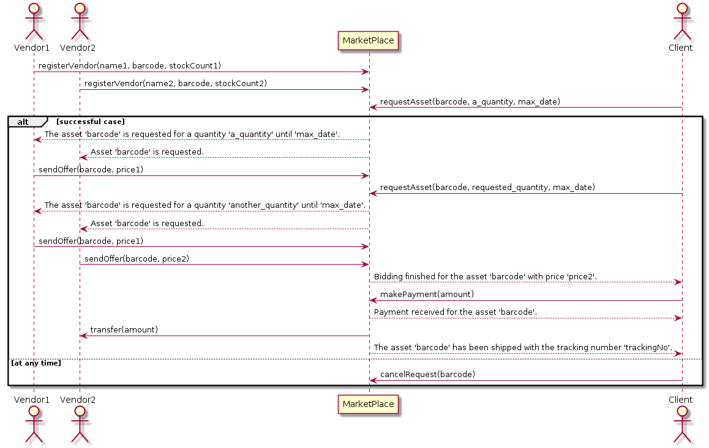

# MarketPlace Contract

## ToDo List
* Add filters for functions
* Catch `throws` from geth console.
  * aContract.aMethod(value, {gas: 3000000}).then(function(){console.log('worked');}, function(){console.log('failed');});

### Designing the Contract

To reveal the functions of the contract, we designed a sequence diagram of the aforementioned scenario.

The next subsection will show how to implement this scenario as a contract.
