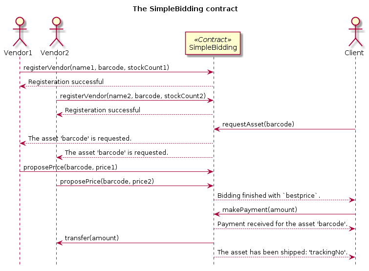

# Simple Bidding Contract

> This example is a continuation of the [Receiving Ethers Using a Contract](./Receiving%20Ethers%20Using%20a%20Contract.md) example.


## Before you begin

Before you begin, make sure that the [Solidity](http://solidity.readthedocs.io/en/develop/index.html) compiler is installed as described [here](https://github.com/ethereum/go-ethereum/wiki/Contract-Tutorial#install-solc-on-ubuntu). To verify if Solidy is installed correctly, go to the geth console and type the `eth.getCompilers()` command. 

``` js
> eth.getCompilers()
["Solidity"]
> 
```

This example is prepared by using the geth version `1.5.9-stable` which is using Go version `go1.7.3` and tested on `Ubuntu 14.04.5`. 

``` bash
Geth
Version: 1.5.9-stable
Git Commit: a07539fb88db7231d18db918ed7a6a4e32f97450
Protocol Versions: [63 62]
Network Id: 1
Go Version: go1.7.3
OS: linux
GOPATH=
GOROOT=/usr/lib/go-1.7
```

## Introduction

In this example, we will develop a simple bidding contract to show how to define and use structures, arrays and functions in more detail.

The simplified bidding process is as follows. First, vendors register to the contract with their asset and stock information. Then a client makes a request to buy the asset. After that, the contract starts a bidding process which ends when a specific number of proposals from the vendors is made. Vendors propose prices for the dedicated asset. Upon finishing the bidding, the contract announces the cheapest proposal for the dedicated asset. The client then sends the expected amount to the contract if it wants to buy the asset with the proposed price. The contract verifies the payment, transfers the amount to the dedicated vendor (Note that the client does not know about the vendor.), updates the stock information of the vendor about the asset and finally ships the asset to the client.

> Note that in this simple example several assumptions and simplification are made. It is assumed that there will be one single asset and one single client. Stock management and transportation is made by the bidding contract. A more realistic scenario will be given in the next example.

Now let's proceed to the development of this system using Solidity in Ethereum.

## Contract: SimpleBidding

In this section, we will develop step by step the `SimpleBidding` contract. 

### Designing the Contract

To reveal the functions of the contract, we designed a sequence diagram of the aforementioned scenario.



The next subsection will show how to implement this scenario as a contract.

### Creating the Contract

Step by step creation of the contract is as follows.

#### Contract body

First, we create the contract body. In the constructor, we save the account address of `contractOwner` using `msg.sender`, and set the deadline in which we can `dispose()` the contract and transfer the funds back.

``` js
pragma solidity ^0.4.10;

/* Contract accepting bids during 30 minutes */
contract SimpleBidding {

    // contract information
    address contractOwner;
    uint deadline;
    
    /* Constructor */
    function SimpleBidding() {
        // set the owner of this contract
        contractOwner = msg.sender;
        // set the deadline of the contract as 10 minutes
        deadline = now + 30 * 1 minutes;
    }         

    modifier afterDeadline() { if (now >= deadline) _; }

    /* when the time limit has been reached and the contract can be ended. */
    function dispose() afterDeadline {
        selfdestruct(contractOwner);
    }
}
```

#### Vendors register themselves

Now, for each function, we will elaborate the contract code. For the `registerVendor` functionality, we add the following: a struct `Vendor` for keeping vendor information, an array of `vendors`, an event which is fired when `VendorRegistered` and the function to `registerVendor()`.

``` js
    ...
    
    // vendor information
    struct Vendor {
        bool isRegistered;
        string name;
        address account;
        uint assetBarcode;
        uint stockCount;
    }
    mapping (address => Vendor) vendors;
    event VendorRegistered(string name, address account, uint assetBarcode, uint stockCount);
    
    ...
    
    /* Used by vendors to register themselves. */
    function registerVendor(string name, uint assetBarcode, uint stockCount) {
        // if the vendor is already registered, exit the function.
        if (vendors[msg.sender].isRegistered) throw;
        // else register the vendor.
        vendors[msg.sender] = Vendor(true, name, msg.sender, assetBarcode, stockCount);
        VendorRegistered(name, msg.sender, assetBarcode, stockCount);
    }
    
    ...
    
```

To see if a vendor is registered properly, and to show how to write a method that returns several values, a `constant` function `getVendor()` is implemented.

``` js
   ...
   
    /* returns the vendor information of the caller */
    function getMyVendorInfo() constant returns (string name, address acc, uint barcode, uint numAssets) {
        var vendor = vendors[msg.sender];
        name = vendor.name;
        acc = vendor.account;
        barcode = vendor.assetBarcode;
        numAssets = vendor.stockCount;
    }
   
   ...
```

#### Client requests an asset

After the vendors are registered, the client can `requestAsset`. A client requests an asset with its `barcode`. Upon receival of this request, an `AssetRequested` event is fired. And then, a bidding process which is expecting `2` proposals for finding the cheapest price is started.

``` js
    ...
    
     // request information
    address client;
    uint requestedAssetBarcode;
    event AssetRequested(address client, uint barcode);
    
    // bidding information
    uint expectedProposals;
    address bestVendor;
    uint bestPrice;

    ...

    /* Used by clients to request assets and start bidding.     */ 
    function requestAsset(uint barcode) {
        // save the requester
        client = msg.sender;
        
        // save the asset barcode
        requestedAssetBarcode = barcode;
        
        // create the event
        AssetRequested(client, requestedAssetBarcode);
        
        // initialize the bidding process
        expectedProposals = 2;
        bestPrice = 999999;
    }
    
    ...   
```

#### Vendors propose prices

Vendors propose prices by using the `proposePrice()` function. When no proposal are expected anymore, the bidding is finished by the contract, and a `BiddingFinished` event is fired with the bidding result.

``` js
    ...
    
    event PriceProposed(string vendorName, uint barcode, uint price);
    event BiddingFinished(uint barcode, uint price);
    
    ...
    
     /* used for checking if a function is called by a registered vendor */
    modifier onlyVendor() { if (vendors[msg.sender].isRegistered) _; }
    
    /* Used by vendors to propose a price for an asset. */
    function proposePrice(uint barcode, uint price) onlyVendor {
        // process the proposal
        PriceProposed(vendors[msg.sender].name, barcode, price);
        if (price < bestPrice) {
            bestPrice = price;
            bestVendor = msg.sender;
        }
        
        // update bidding condition
        expectedProposals--;
        
        if (expectedProposals == 0) {
            BiddingFinished(requestedAssetBarcode, bestPrice);
        }
    }
   
    ...
```

#### Client makes the payment

If the client accepts the price, it make a plain ether transaction which, in response, invokes the nameless `()` function. This function checks the sender and the `amount`, transfers the `amount` to the winning vendor and then fires a `PaymentReceived` event. Lastly, it fires an `AssetShipped` event to complete the scenario.

``` js
    ...
    
    // payment information
    event PaymentReceived(address sender, uint amount, uint barcode);
    event AssetShipped(uint barcode, uint trackingNumber);
  
    ...
    
    /* The function without name is the default function that is called whenever 
       anyone sends funds to a contract */
    function () public payable {
        if (msg.sender == client) {
            uint amount = msg.value;
            if (amount == bestPrice) {
                // transfer the payment to the vendor
                bestVendor.send(amount);
                // reduce the asset from the vendor's stock
                // ...to be implemented...
                
                // create the event
                PaymentReceived(msg.sender, msg.value, requestedAssetBarcode);
                
                // ship the asset
                uint trackingNumber = 78623235235;
                AssetShipped(requestedAssetBarcode, trackingNumber);
            }
            
        }
    }
    
    ...
```

#### Final Contract Code

Finally, the full contract code will be as below.

``` js
pragma solidity ^0.4.10;

/* Contract accepting bids during 30 minutes */
contract SimpleBidding {

    // contract information
    address contractOwner;
    uint deadline;
    
    // vendor information
    struct Vendor {
        bool isRegistered;
        string name;
        address account;
        uint assetBarcode;
        uint stockCount;
    }
    mapping (address => Vendor) vendors;
    event VendorRegistered(string name, address account, uint assetBarcode, uint stockCount);

    // request information
    address client;
    uint requestedAssetBarcode;
    event AssetRequested(address client, uint barcode);
    
    // bidding information
    uint expectedProposals;
    address bestVendor;
    uint bestPrice;
    event PriceProposed(string vendorName, uint barcode, uint price);
    event BiddingFinished(uint barcode, uint price);

    // payment information
    event PaymentReceived(address sender, uint amount, uint barcode);
    event AssetShipped(uint barcode, uint trackingNumber);

    /* Constructor */
    function SimpleBidding() {
        // set the owner of this contract
        contractOwner = msg.sender;
        // set the deadline of the contract as 10 minutes
        deadline = now + 30 * 1 minutes;
    }  
    
    /* Used by vendors to register themselves. */
    function registerVendor(string name, uint assetBarcode, uint stockCount) {
        // if the vendor is already registered, exit the function.
        if (vendors[msg.sender].isRegistered) throw;
        // else register the vendor.
        vendors[msg.sender] = Vendor(true, name, msg.sender, assetBarcode, stockCount);
        VendorRegistered(name, msg.sender, assetBarcode, stockCount);
    }
    
    /* Used by clients to request assets and start bidding.     */ 
    function requestAsset(uint barcode) {
        // save the requester
        client = msg.sender;
        
        // save the asset barcode
        requestedAssetBarcode = barcode;
        
        // create the event
        AssetRequested(client, requestedAssetBarcode);
        
        // initialize the bidding process
        expectedProposals = 2;
        bestPrice = 999999;
    }
    
    /* used for checking if a function is called by a registered vendor */
    modifier onlyVendor() { if (vendors[msg.sender].isRegistered) _; }
    
    /* Used by vendors to propose a price for an asset. */
    function proposePrice(uint barcode, uint price) onlyVendor {
        // process the proposal
        PriceProposed(vendors[msg.sender].name, barcode, price);
        if (price < bestPrice) {
            bestPrice = price;
            bestVendor = msg.sender;
        }
        
        // update bidding condition
        expectedProposals--;
        
        if (expectedProposals == 0) {
            BiddingFinished(requestedAssetBarcode, bestPrice);
        }
    }
    
     /* The function without name is the default function that is called whenever 
       anyone sends funds to a contract */
    function () public payable {
        if (msg.sender == client) {
            uint amount = msg.value;
            if (amount == bestPrice) {
                // transfer the payment to the vendor
                bestVendor.send(amount);
                // reduce the asset from the vendor's stock
                // ...to be implemented...
                
                // create the event
                PaymentReceived(msg.sender, msg.value, requestedAssetBarcode);
                
                // ship the asset
                uint trackingNumber = 78623235235;
                AssetShipped(requestedAssetBarcode, trackingNumber);
            }
            
        }
    }
    
    /* returns the vendor information of the caller */
    function getMyVendorInfo() constant returns (string name, address acc, uint barcode, uint numAssets) {
        var vendor = vendors[msg.sender];
        name = vendor.name;
        acc = vendor.account;
        barcode = vendor.assetBarcode;
        numAssets = vendor.stockCount;
    }

    modifier afterDeadline() { if (now >= deadline) _; }

    /* when the time limit has been reached and the contract can be ended. */
    function dispose() afterDeadline {
        selfdestruct(contractOwner);
    }
}
```

You can only directly call the functions that do not modify the state of the contract, i.e. `constant functions`. Functions modifying the state of a contract (i.e. `non-constant function`) can only be called via transactions.

### Compiling the Contract

Upon compiling the above solidty code using the [online Solidity compiler](https://ethereum.github.io/browser-solidity/), we will have a JavaScript code as below.

``` js
var simplebidding_sol_simplebiddingContract = web3.eth.contract([{"constant":false,"inputs":[{"name":"name","type":"string"},{"name":"assetBarcode","type":"uint256"},{"name":"stockCount","type":"uint256"}],"name":"registerVendor","outputs":[],"payable":false,"type":"function"},{"constant":false,"inputs":[{"name":"barcode","type":"uint256"}],"name":"requestAsset","outputs":[],"payable":false,"type":"function"},{"constant":false,"inputs":[],"name":"dispose","outputs":[],"payable":false,"type":"function"},{"constant":true,"inputs":[],"name":"getMyVendorInfo","outputs":[{"name":"name","type":"string"},{"name":"acc","type":"address"},{"name":"barcode","type":"uint256"},{"name":"numAssets","type":"uint256"}],"payable":false,"type":"function"},{"constant":false,"inputs":[{"name":"barcode","type":"uint256"},{"name":"price","type":"uint256"}],"name":"proposePrice","outputs":[],"payable":false,"type":"function"},{"inputs":[],"payable":false,"type":"constructor"},{"payable":true,"type":"fallback"},{"anonymous":false,"inputs":[{"indexed":false,"name":"name","type":"string"},{"indexed":false,"name":"account","type":"address"},{"indexed":false,"name":"assetBarcode","type":"uint256"},{"indexed":false,"name":"stockCount","type":"uint256"}],"name":"VendorRegistered","type":"event"},{"anonymous":false,"inputs":[{"indexed":false,"name":"client","type":"address"},{"indexed":false,"name":"barcode","type":"uint256"}],"name":"AssetRequested","type":"event"},{"anonymous":false,"inputs":[{"indexed":false,"name":"vendorName","type":"string"},{"indexed":false,"name":"barcode","type":"uint256"},{"indexed":false,"name":"price","type":"uint256"}],"name":"PriceProposed","type":"event"},{"anonymous":false,"inputs":[{"indexed":false,"name":"barcode","type":"uint256"},{"indexed":false,"name":"price","type":"uint256"}],"name":"BiddingFinished","type":"event"},{"anonymous":false,"inputs":[{"indexed":false,"name":"sender","type":"address"},{"indexed":false,"name":"amount","type":"uint256"},{"indexed":false,"name":"barcode","type":"uint256"}],"name":"PaymentReceived","type":"event"},{"anonymous":false,"inputs":[{"indexed":false,"name":"barcode","type":"uint256"},{"indexed":false,"name":"trackingNumber","type":"uint256"}],"name":"AssetShipped","type":"event"}]);
var simplebidding_sol_simplebidding = simplebidding_sol_simplebiddingContract.new(
   {
     from: web3.eth.accounts[0], 
     data: '0x6060604052341561000c57fe5b5b60008054600160a060020a03191633600160a060020a031617905542610708016001555b5b610843806100416000396000f300606060405236156100515763ffffffff60e060020a600035041663056b2add81146101425780632b25d4fd146101a15780634c86659e146101b65780636a807d41146101c8578063e161926914610284575b6101405b600354600090819033600160a060020a039081169116141561013a5734915060075482141561013a57600654604051600160a060020a039091169083156108fc029084906000818181858888f1505060045460408051600160a060020a033316815234602082015280820192909252517f5677b5d4cf976ac32defbd95a6a5aaf0d1fee450a11fc26f3c11aae6e6c33d0694509081900360600192509050a1506004546040805191825264124e4f5ca360208301819052815190927fb392290afa7f5b07c58b82f2a4f36a13e77050183671211ed5b5f27ca86b135e92908290030190a15b5b5b5050565b005b341561014a57fe5b610140600480803590602001908201803590602001908080601f016020809104026020016040519081016040528093929190818152602001838380828437509496505084359460200135935061029c92505050565b005b34156101a957fe5b610140600435610446565b005b34156101be57fe5b6101406104c7565b005b34156101d057fe5b6101d86104e2565b604051808060200185600160a060020a0316600160a060020a03168152602001848152602001838152602001828103825286818151815260200191508051906020019080838360008314610247575b80518252602083111561024757601f199092019160209182019101610227565b505050905090810190601f1680156102735780820380516001836020036101000a031916815260200191505b509550505050505060405180910390f35b341561028c57fe5b6101406004356024356105bf565b005b600160a060020a03331660009081526002602052604090205460ff16156102c35760006000fd5b6040805160a0810182526001808252602080830187815233600160a060020a03168486018190526060850188905260808501879052600090815260028352949094208351815460ff19169015151781559351805193949361032b938501929190910190610765565b5060408201518160020160006101000a815481600160a060020a030219169083600160a060020a0316021790555060608201518160030155608082015181600401559050507ff69139b4209a3ee7db09bbe1d00359ca79993b7f7e1cc501f2784240c58aca6c83338484604051808060200185600160a060020a0316600160a060020a03168152602001848152602001838152602001828103825286818151815260200191508051906020019080838360008314610404575b80518252602083111561040457601f1990920191602091820191016103e4565b505050905090810190601f1680156104305780820380516001836020036101000a031916815260200191505b509550505050505060405180910390a15b505050565b6003805473ffffffffffffffffffffffffffffffffffffffff191633600160a060020a0390811691909117918290556004839055604080519290911682526020820183905280517f182330bdae199ac3ad3e13c76eb719f687f880653f8dee040adc74327eaf3a669281900390910190a16002600555620f423f6007555b50565b60015442106104de57600054600160a060020a0316ff5b5b5b565b6104ea6107e4565b33600160a060020a031660009081526002602081815260408084206001808201805484519281161561010002600019011695909504601f8101859004850282018501909352828152859485949293919290919083018282801561058e5780601f106105635761010080835404028352916020019161058e565b820191906000526020600020905b81548152906001019060200180831161057157829003601f168201915b505050600284015460038501546004860154949950600160a060020a039091169750955091935050505b5090919293565b600160a060020a03331660009081526002602052604090205460ff161561013a577f4cc192b974e708b4556e771d6b0425e65a284b111616339527df19b8b9c31ce46002600033600160a060020a0316600160a060020a03168152602001908152602001600020600101838360405180806020018481526020018381526020018281038252858181546001816001161561010002031660029004815260200191508054600181600116156101000203166002900480156106c05780601f10610695576101008083540402835291602001916106c0565b820191906000526020600020905b8154815290600101906020018083116106a357829003601f168201915b505094505050505060405180910390a16007548110156107085760078190556006805473ffffffffffffffffffffffffffffffffffffffff191633600160a060020a03161790555b600580546000190190819055151561013a577fc17eabdf34dbdda04d4e5bc7f639984fff1d8a51ba4bb7f728e59744c3320e07600454600754604051808381526020018281526020019250505060405180910390a15b5b5b5b5050565b828054600181600116156101000203166002900490600052602060002090601f016020900481019282601f106107a657805160ff19168380011785556107d3565b828001600101855582156107d3579182015b828111156107d35782518255916020019190600101906107b8565b5b506107e09291506107f6565b5090565b60408051602081019091526000815290565b61081491905b808211156107e057600081556001016107fc565b5090565b905600a165627a7a723058201609ff14c2f9edb50ee58f14d4d54699babb612291ff7b91b3084a91c0510f940029', 
     gas: '4700000'
   }, function (e, contract){
    console.log(e, contract);
    if (typeof contract.address !== 'undefined') {
         console.log('Contract mined! address: ' + contract.address + ' transactionHash: ' + contract.transactionHash);
    }
 })
 ```

However, as you remember in geth accounts are locked by default. Thus, we need to embed the unlock command inside the JavaSacript code.
In addition, we need to configure the watchers for the events we want to follow. The final deployment script becomes as below.

``` js
// unlock all accounts
loadScript("config/UnlockAccounts.js");
// contract code
var simplebidding_sol_simplebiddingContract = web3.eth.contract([{"constant":false,"inputs":[{"name":"name","type":"string"},{"name":"assetBarcode","type":"uint256"},{"name":"stockCount","type":"uint256"}],"name":"registerVendor","outputs":[],"payable":false,"type":"function"},{"constant":false,"inputs":[{"name":"barcode","type":"uint256"}],"name":"requestAsset","outputs":[],"payable":false,"type":"function"},{"constant":false,"inputs":[],"name":"dispose","outputs":[],"payable":false,"type":"function"},{"constant":true,"inputs":[],"name":"getMyVendorInfo","outputs":[{"name":"name","type":"string"},{"name":"acc","type":"address"},{"name":"barcode","type":"uint256"},{"name":"numAssets","type":"uint256"}],"payable":false,"type":"function"},{"constant":false,"inputs":[{"name":"barcode","type":"uint256"},{"name":"price","type":"uint256"}],"name":"proposePrice","outputs":[],"payable":false,"type":"function"},{"inputs":[],"payable":false,"type":"constructor"},{"payable":true,"type":"fallback"},{"anonymous":false,"inputs":[{"indexed":false,"name":"name","type":"string"},{"indexed":false,"name":"account","type":"address"},{"indexed":false,"name":"assetBarcode","type":"uint256"},{"indexed":false,"name":"stockCount","type":"uint256"}],"name":"VendorRegistered","type":"event"},{"anonymous":false,"inputs":[{"indexed":false,"name":"client","type":"address"},{"indexed":false,"name":"barcode","type":"uint256"}],"name":"AssetRequested","type":"event"},{"anonymous":false,"inputs":[{"indexed":false,"name":"vendorName","type":"string"},{"indexed":false,"name":"barcode","type":"uint256"},{"indexed":false,"name":"price","type":"uint256"}],"name":"PriceProposed","type":"event"},{"anonymous":false,"inputs":[{"indexed":false,"name":"barcode","type":"uint256"},{"indexed":false,"name":"price","type":"uint256"}],"name":"BiddingFinished","type":"event"},{"anonymous":false,"inputs":[{"indexed":false,"name":"sender","type":"address"},{"indexed":false,"name":"amount","type":"uint256"},{"indexed":false,"name":"barcode","type":"uint256"}],"name":"PaymentReceived","type":"event"},{"anonymous":false,"inputs":[{"indexed":false,"name":"barcode","type":"uint256"},{"indexed":false,"name":"trackingNumber","type":"uint256"}],"name":"AssetShipped","type":"event"}]);
var simplebidding_sol_simplebidding = simplebidding_sol_simplebiddingContract.new(
   {
     from: web3.eth.accounts[0], 
     data: '0x6060604052341561000c57fe5b5b60008054600160a060020a03191633600160a060020a031617905542610708016001555b5b610843806100416000396000f300606060405236156100515763ffffffff60e060020a600035041663056b2add81146101425780632b25d4fd146101a15780634c86659e146101b65780636a807d41146101c8578063e161926914610284575b6101405b600354600090819033600160a060020a039081169116141561013a5734915060075482141561013a57600654604051600160a060020a039091169083156108fc029084906000818181858888f1505060045460408051600160a060020a033316815234602082015280820192909252517f5677b5d4cf976ac32defbd95a6a5aaf0d1fee450a11fc26f3c11aae6e6c33d0694509081900360600192509050a1506004546040805191825264124e4f5ca360208301819052815190927fb392290afa7f5b07c58b82f2a4f36a13e77050183671211ed5b5f27ca86b135e92908290030190a15b5b5b5050565b005b341561014a57fe5b610140600480803590602001908201803590602001908080601f016020809104026020016040519081016040528093929190818152602001838380828437509496505084359460200135935061029c92505050565b005b34156101a957fe5b610140600435610446565b005b34156101be57fe5b6101406104c7565b005b34156101d057fe5b6101d86104e2565b604051808060200185600160a060020a0316600160a060020a03168152602001848152602001838152602001828103825286818151815260200191508051906020019080838360008314610247575b80518252602083111561024757601f199092019160209182019101610227565b505050905090810190601f1680156102735780820380516001836020036101000a031916815260200191505b509550505050505060405180910390f35b341561028c57fe5b6101406004356024356105bf565b005b600160a060020a03331660009081526002602052604090205460ff16156102c35760006000fd5b6040805160a0810182526001808252602080830187815233600160a060020a03168486018190526060850188905260808501879052600090815260028352949094208351815460ff19169015151781559351805193949361032b938501929190910190610765565b5060408201518160020160006101000a815481600160a060020a030219169083600160a060020a0316021790555060608201518160030155608082015181600401559050507ff69139b4209a3ee7db09bbe1d00359ca79993b7f7e1cc501f2784240c58aca6c83338484604051808060200185600160a060020a0316600160a060020a03168152602001848152602001838152602001828103825286818151815260200191508051906020019080838360008314610404575b80518252602083111561040457601f1990920191602091820191016103e4565b505050905090810190601f1680156104305780820380516001836020036101000a031916815260200191505b509550505050505060405180910390a15b505050565b6003805473ffffffffffffffffffffffffffffffffffffffff191633600160a060020a0390811691909117918290556004839055604080519290911682526020820183905280517f182330bdae199ac3ad3e13c76eb719f687f880653f8dee040adc74327eaf3a669281900390910190a16002600555620f423f6007555b50565b60015442106104de57600054600160a060020a0316ff5b5b5b565b6104ea6107e4565b33600160a060020a031660009081526002602081815260408084206001808201805484519281161561010002600019011695909504601f8101859004850282018501909352828152859485949293919290919083018282801561058e5780601f106105635761010080835404028352916020019161058e565b820191906000526020600020905b81548152906001019060200180831161057157829003601f168201915b505050600284015460038501546004860154949950600160a060020a039091169750955091935050505b5090919293565b600160a060020a03331660009081526002602052604090205460ff161561013a577f4cc192b974e708b4556e771d6b0425e65a284b111616339527df19b8b9c31ce46002600033600160a060020a0316600160a060020a03168152602001908152602001600020600101838360405180806020018481526020018381526020018281038252858181546001816001161561010002031660029004815260200191508054600181600116156101000203166002900480156106c05780601f10610695576101008083540402835291602001916106c0565b820191906000526020600020905b8154815290600101906020018083116106a357829003601f168201915b505094505050505060405180910390a16007548110156107085760078190556006805473ffffffffffffffffffffffffffffffffffffffff191633600160a060020a03161790555b600580546000190190819055151561013a577fc17eabdf34dbdda04d4e5bc7f639984fff1d8a51ba4bb7f728e59744c3320e07600454600754604051808381526020018281526020019250505060405180910390a15b5b5b5b5050565b828054600181600116156101000203166002900490600052602060002090601f016020900481019282601f106107a657805160ff19168380011785556107d3565b828001600101855582156107d3579182015b828111156107d35782518255916020019190600101906107b8565b5b506107e09291506107f6565b5090565b60408051602081019091526000815290565b61081491905b808211156107e057600081556001016107fc565b5090565b905600a165627a7a723058201609ff14c2f9edb50ee58f14d4d54699babb612291ff7b91b3084a91c0510f940029', 
     gas: '4700000'
   }, function (e, contract){
    console.log(e, contract);
    if (typeof contract.address !== 'undefined') {
    	// Contract is mined.
    	console.log('Contract mined! address: ' + contract.address + ' transactionHash: ' + contract.transactionHash);	 
        // Event VendorRegistered
    	contract.VendorRegistered().watch(function(error, result){
	   if (!error)
	      console.log("[" + result.args.name + " has been registered as a vendor with the account number " + result.args.account + ". It has " + result.args.stockCount + " number of the asset " + result.args.barcode + " in its stock.]");
	});
    	// Event AssetRequested
    	contract.AssetRequested().watch(function(error, result){
	   if (!error)
	      console.log("[Asset " + result.args.barcode + " requested by " + result.args.client + "]");
	});   
	// Event PriceProposed      
	contract.PriceProposed().watch(function(error, result){
	   if (!error)
	      console.log("[A price " + result.args.price + " is proposed for the asset " + result.args.barcode + " by " + result.args.vendorName + "]");
	});	 
	// Event BiddingFinished
	contract.BiddingFinished().watch(function(error, result){
	   if (!error)
	      console.log("[Bidding finished for the asset " + result.args.barcode + " with the price " + result.args.price + ". Make the payment if you want to buy the asset.]");
	});
	// Event PaymentReceived
	contract.PaymentReceived().watch(function(error, result){
	   if (!error)
	      console.log("[A payment of "+ result.args.amount + " is received from " + result.args.sender + " for the asset " + result.args.barcode + ".]");
	});
	// Event AssetShipped
        contract.AssetShipped().watch(function(error, result){
	   if (!error)
	      console.log("[The asset " + result.args.barcode + " has been shipped with the tracking number " + result.args.trackingNumber + ".]");
	});
    }
 })
```

Save the above code as `SimpleBidding.js` under `contracts/SimpleBidding/`.

### Deploying the Contract

Now open the geth console and start the mining process.

``` bash
$ sh ./bin/console.sh 
Welcome to the Geth JavaScript console!

instance: Geth/Node01/v1.5.9-stable-a07539fb/linux/go1.7.3
coinbase: 0x6c1eddcce57c4d7b2231515fe3586ebaac20c661
at block: 439 (Mon, 03 Apr 2017 11:33:07 CEST)
 datadir: /export/home/og240447/blockchain/ethereum/local-private-network/Node01
 modules: admin:1.0 debug:1.0 eth:1.0 miner:1.0 net:1.0 personal:1.0 rpc:1.0 txpool:1.0 web3:1.0

> miner.start(2)
true
>
```

Then deploy `SimpleBidding.js` using `loadScript()`.

``` bash
> loadScript("contracts/SimpleBidding/SimpleBidding.js")
null [object Object]
true
> null [object Object]
Contract mined! address: 0x56a4e1d0e5ee212e18bf5cd70c3a5f417990b54b transactionHash: 0xb6fb60c6a0f05e69bda76e2a8ac005df0cc430d4a5487c7bc39c9be69d0b4c0e
>   
```

### Using the Contract

After the contract is mined successfully, clients and vendors can use it. It is assumed that there is one client and two vendors and they use `Account 0`, `Account 1` and `Account 2` respectively. Suppose the two vendors, `Vendor1` and `Vendor2`, have an asset with the barcode number `1234` in their stock. `Vendor1` has `2` assets.

First, `Vendor1` sends a registration request to the contract.

``` bash
> simplebidding_sol_simplebidding.registerVendor("Vendor1", 1234, 2, {from: eth.accounts[1], gas: 1000000});
"0x4b965d379706b601acf60be3feb73b96f4fd399cc62da77dca023925d5f0948d"
> [Vendor1 has been registered as a vendor with the account number 0xaad7a7d0dc77e8cf2c1bbbaab556bc0d5dff4bdc. It has 2 number of the asset undefined in its stock.]
>
```

Then, `Vendor2` sends a registration request to the contract. 

``` bash
> simplebidding_sol_simplebidding.registerVendor("Vendor2", 1234, 1, {from: eth.accounts[2], gas: 1000000});
"0x231c18488039e4a6acb4da81a441e31ae28eb38dc0849fb170206e5072932a77"
> [Vendor2 has been registered as a vendor with the account number 0x25c6bf0b1637b9c04a4f715876c0f891e9daba32. It has 1 number of the asset undefined in its stock.]
>
```

Anytime after, `Client` makes a request for the asset `1234`.

``` bash
> simplebidding_sol_simplebidding.requestAsset(1234, {from: eth.accounts[0], gas: 1000000});
"0x275921ed7b3110d6037166db65ebc08e013a44280e0f697bbd542ef814790139"
> [Asset 1234 requested by 0x6c1eddcce57c4d7b2231515fe3586ebaac20c661]
>
```

Upon the start of the bidding, `Vendor1` and `Vendor2` propose the prices `11` and `10` respectively.

``` bash
> simplebidding_sol_simplebidding.proposePrice(1234, 11, {from: eth.accounts[1], gas: 1000000});
"0xd6951ba946f01b235155e4e41b045c9c2314349ad09d9f34d25001c6a369cdb3"
> [A price 11 is proposed for the asset 1234 by Vendor1]
> simplebidding_sol_simplebidding.proposePrice(1234, 10, {from: eth.accounts[2], gas: 1000000});
"0x127006762ba19dd1990982b12cb931ab0a2823dec1984ef341d3c8b71eb0d308"
> [A price 10 is proposed for the asset 1234 by Vendor2]
```

Having two proposal finishes the bidding process and the contract announces the best price.

``` bash
[Bidding finished for the asset 1234 with the price 10. Make the payment if you want to buy the asset.]
``` 

`Client` sends the requested amount `10` to the contract using the address that was verbosed when the contract was mined (`0x56a4e1d0e5ee212e18bf5cd70c3a5f417990b54b`). 

``` bash
> var tx = {from:  eth.accounts[0], to: "0x56a4e1d0e5ee212e18bf5cd70c3a5f417990b54b", value: 10}
undefined
> personal.sendTransaction(tx, "Node01Account00")
"0x6fd3b765669594279cc9a0ca75a68bb1b4a73960727c548b348d3b84d6ea0146"
``` 

The contract receives the amount, announces that and ships the asset to `Client`.

``` bash
> [A payment of 10 is received from 0x6c1eddcce57c4d7b2231515fe3586ebaac20c661 for the asset 1234.]
[The asset 1234 has been shipped with the tracking number 78623235235.]
> 
```

### Separating the Geth Clients

It is hard to follow which stakeholder doing what when we show them inside one single `geth` client. A better practice would be opening a `geth` client for each stakeholder.

> Note that, we are running our examples in a local private network where there is one single node (for instance) which has several accounts.

## What's next?


